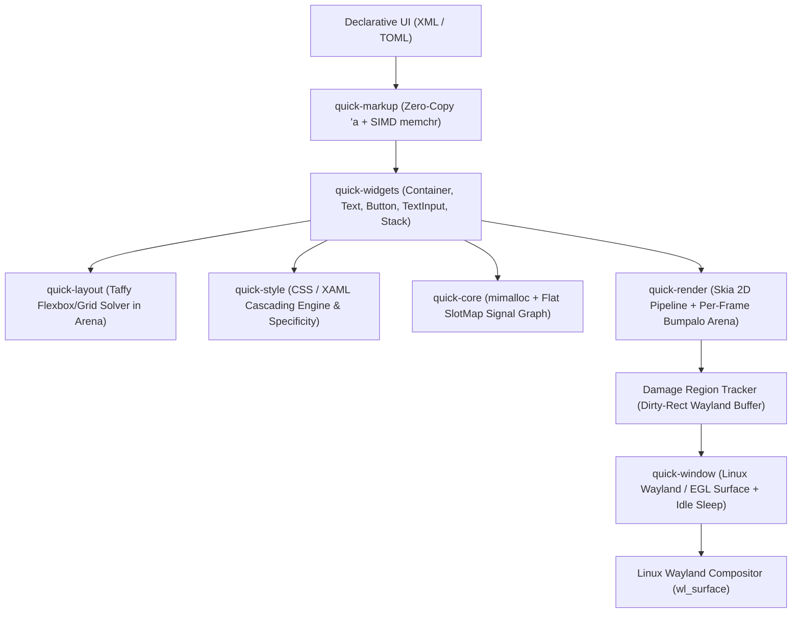

# ⚡ Quick

**Quick** is a blazing-fast, lightweight, and modern native application and UI framework written in **100% Pure Rust**.

Designed with the performance and memory principles of **Bun's Rust architecture**, Quick combines high-throughput memory allocators, zero-copy declarative UI parsing, fine-grained reactive signals, hardware-accelerated 2D graphics via Skia, and native Linux Wayland windowing.

---

## 🚀 Key Features

- **🦀 100% Pure Rust**: Zero memory leaks, zero use-after-free bugs, and compile-time thread-safety.
- **⚡ Bun-Inspired Performance**:
  - **`mimalloc` Global Allocator**: Lock-free thread-local memory pools eliminating allocation contention.
  - **Per-Frame Arena Allocators (`bumpalo`)**: $O(1)$ ephemeral layout and display list allocation with instant bulk resets.
  - **Zero-Copy SIMD Parsing (`memchr`, `simdutf8`)**: Vectorized XML, TOML, and CSS parsing scanning up to 64 bytes/cycle directly over memory-mapped assets.
- **🎨 Skia 2D Canvas Graphics Pipeline**: GPU-accelerated DirectContext (EGL / OpenGL ES) with software raster fallback.
- **🐧 Linux Wayland Native**: First-class Wayland protocol integration with dirty-rect damage region tracking and **0.0% CPU usage at idle**.
- **🔄 Fine-Grained Reactive Signals**: Arena-backed `Signal<T>`, `create_computed`, and `create_effect` updating target widgets directly with zero lock overhead.
- **📄 Declarative UI (XML & TOML)**: XAML-style XML and config-driven TOML layouts with CSS styling, class selectors (`.btn`), pseudo-states (`:hover`, `:active`), and dynamic signal data-binding.
- **📦 Compact Binary Footprint**: Configured with whole-program Fat LTO, symbol stripping, and `panic = "abort"` targeting release binaries under 8MB.

---

## 🏛️ Architecture Overview



---

## 📁 Workspace Crates

| Crate | Description |
| :--- | :--- |
| **[`quick-core`](crates/quick-core)** | Reactive Signals engine (`Signal<T>`, `create_computed`), `mimalloc` integration, geometry, and event definitions. |
| **[`quick-style`](crates/quick-style)** | CSS and XAML stylesheet parser with SIMD delimiter scanning, selector specificity, and property cascades. |
| **[`quick-render`](crates/quick-render)** | Skia 2D Canvas pipeline, display list recording, per-frame bump arena, and dirty-rect damage tracking. |
| **[`quick-window`](crates/quick-window)** | Linux Wayland windowing backend (via `winit` + `raw-window-handle`) and event translation bridge. |
| **[`quick-layout`](crates/quick-layout)** | High-speed Flexbox and CSS Grid layout solver powered by Taffy with frame arena memory. |
| **[`quick-widgets`](crates/quick-widgets)** | Core interactive widgets (`Container`, `Text`, `Button`, `TextInput`, `VStack`, `HStack`). |
| **[`quick-markup`](crates/quick-markup)** | Zero-copy Serde deserializer for XML (XAML-style) and TOML declarative UI documents with dynamic `DataContext` bindings. |
| **[`quick`](crates/quick)** | Unified umbrella crate and `App` lifecycle coordinator. |

---

## 🛠️ Quick Start

### 1. Declarative XML UI (`app.xml`)

```xml
<VStack id="main" class="surface" style="padding: 32px; gap: 16px; align-items: center; justify-content: center; background: #1e1e2e;">
    <Style>
        Text.title { font-size: 24px; color: #cdd6f4; font-weight: bold; }
        Text.counter { font-size: 32px; color: #89b4fa; font-weight: bold; }
        Button.btn-primary { background: #89b4fa; color: #11111b; padding: 10px 24px; border-radius: 8px; font-weight: bold; }
        Button.btn-primary:hover { background: #b4befe; }
    </Style>

    <Text class="title" text="⚡ Quick Framework Demo" />
    <Text id="count-display" class="counter" text="$counter_display" />

    <HStack style="gap: 12px; margin: 16px;">
        <Button id="btn-dec" text="➖ Decrement" onclick="decrement" />
        <Button id="btn-inc" class="btn-primary" text="➕ Increment" onclick="increment" />
    </HStack>
</VStack>
```

### 2. Rust Application Code (`src/main.rs`)

```rust
use quick::prelude::*;

// Optional: High-throughput mimalloc global allocator
#[cfg(feature = "mimalloc")]
#[global_allocator]
static GLOBAL: quick::core::MiMalloc = quick::core::MiMalloc;

fn main() -> Result<(), Box<dyn std::error::Error>> {
    // 1. Reactive State
    let count = Signal::new(0);
    let count_sig = count.clone();

    let counter_display = create_computed(move || {
        format!("Count: {}", count_sig.get())
    });

    // 2. DataContext Binding
    let mut data_ctx = DataContext::new();
    data_ctx.bind_signal("counter_display", counter_display);

    let count_inc = count.clone();
    data_ctx.bind_action("increment", move || count_inc.update(|v| *v += 1));

    let count_dec = count.clone();
    data_ctx.bind_action("decrement", move || count_dec.update(|v| *v -= 1));

    // 3. Build and Run App
    let xml_content = include_str!("../app.xml");
    let mut app = App::new(
        WindowOptions::new()
            .title("Quick Application")
            .size(800.0, 600.0),
    )
    .from_xml(xml_content, &mut data_ctx)?;

    // 4. Render Frame (Runs layout & Skia canvas pipeline in frame arena)
    let canvas = app.render_frame(Size::new(800.0, 600.0));
    println!("Rendered frame with {} draw commands.", canvas.commands().len());

    Ok(())
}
```

---

## ⚡ Performance Profiles

Configured in `Cargo.toml`:

```toml
[profile.release]
opt-level = 3
lto = "fat"
codegen-units = 1
panic = "abort"
strip = true
overflow-checks = false
```

---

## 📄 License

Dual-licensed under either:
- Apache License, Version 2.0 ([LICENSE-APACHE](LICENSE-APACHE) or http://www.apache.org/licenses/LICENSE-2.0)
- MIT license ([LICENSE-MIT](LICENSE-MIT) or http://opensource.org/licenses/MIT)

at your option.
