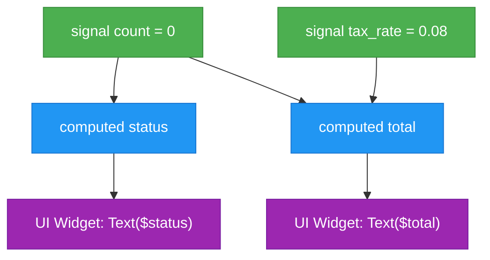

# Silver Language Architecture & Design Guide
*Design Philosophy, Internal Architecture, and UI Engine Synergy*

---

## 1. Why Silver? Design Goals & Philosophy

Modern UI development demands a delicate balance between **raw rendering performance** and **developer iteration speed**:
- **Rust** provides unbeatable memory safety, zero-cost abstractions, and 120 FPS GPU rendering, but compiling complex UI state changes and event bindings causes slow iteration loops.
- **JavaScript / TypeScript (V8/Node)** introduces large runtime memory footprints, garbage collection pauses, and awkward multi-layer FFI bridging.
- **Lua / Python** lack native reactivity primitives and require boilerplate wrappers around reactive signal graphs.

**Silver (`.silver`) was created to solve this dilemma.**

```
┌────────────────────────────────────────────────────────┐
│                   SILVER APPLICATION                   │
│                                                        │
│   ┌──────────────────────┐    ┌────────────────────┐   │
│   │ Declarative Markup   │    │ Reactive Logic     │   │
│   │ (app.quick)          │    │ (app.silver)       │   │
│   └──────────┬───────────┘    └─────────┬──────────┘   │
└──────────────┼──────────────────────────┼──────────────┘
               ▼                          ▼
┌────────────────────────────────────────────────────────┐
│                   QUICK CORE ENGINE                    │
│                                                        │
│   • DataContext Binding       • Reactive Signal Graph  │
│   • Fine-grained Dirty Rects  • M3 Dynamic Theming     │
│   • Taffy Flex/Grid Layout    • Vello GPU 2D Compute   │
└────────────────────────────────────────────────────────┘
```

### Core Tenets
1. **Reactivity as Syntax, Not a Library**: State is not managed through `useState`, `Observable`, or manual event emitters. State is declared natively with `signal`, `computed`, and `effect`.
2. **Microsecond Startup & Instant Execution**: Bytecode compilation takes less than 1ms. Changes take effect instantly without restarting cargo builds.
3. **Zero-Overhead Memory Footprint**: Uses atomic ref-counted data types (`Arc<String>`, `Arc<Mutex<Vec<Value>>>`), small stack frames, and bump-allocated chunks.
4. **Native Design System Integration**: Hex color literals `#RRGGBB[AA]` and theme tokens are first-class language values.

---

## 2. Language Comparison Matrix

| Feature | Silver (`.silver`) | Rust (Quick Native) | TypeScript (React / Web) | Swift / SwiftUI | Lua |
| :--- | :--- | :--- | :--- | :--- | :--- |
| **Primary Domain** | UI Logic & State | Engine & Core Graphics | Web & Electron Apps | Apple Platforms | Scripting & Games |
| **Execution Model** | Bytecode Virtual Machine | Native AOT Binary | JIT (V8/JSC) | Native LLVM Binary | Bytecode VM |
| **Reactivity** | **First-Class Keywords** | `Signal<T>` structs | Hooks / Virtual DOM | `@State` / Observation | Manual callbacks |
| **Compilation Speed**| **< 1 millisecond** | 5s – 60s+ | 1s – 5s | 5s – 30s | < 1 millisecond |
| **Memory Footprint** | **~200 KB runtime** | Zero overhead | 30 MB – 150 MB+ | Small | ~150 KB |
| **Native Colors** | **Yes (`#6750A4`)** | Via struct constructor | Via CSS strings | Via `Color(...)` | No |
| **UI Engine** | **Quick UI (Vello GPU)**| Quick UI | DOM / Canvas | Metal / UIKit | Custom |

---

## 3. The Reactive Engine: Signals, Computed, & Effects

### 3.1 The Granular Reactivity Graph
Unlike Virtual DOM frameworks that diff entire component subtrees on every state update, Silver utilizes a **fine-grained directed acyclic graph (DAG)**:



### 3.2 Execution Lifecycle
1. **Signal Declaration**: `signal count = 10` allocates an entry in the reactive store.
2. **Dependency Auto-Tracking**: When `computed status` runs, accessing `count` automatically registers `status` as a dependent of `count`.
3. **Zero-Latency Notification**: When `count += 1` executes, only `status` is invalidated. Unrelated signals (e.g. `tax_rate`) are untouched.
4. **Batching Support**: Multiple mutations wrapped in an action flush notifications only once at the end of the transaction.

---

## 4. Virtual Machine Architecture

The Silver VM is a high-speed, 64-bit stack-based interpreter:

```
┌─────────────────────────────────────────────────────────────┐
│                      SILVER VM MEMORY                       │
├──────────────────────────────┬──────────────────────────────┤
│  STACK (Evaluations & Args)  │  GLOBALS & SIGNAL REGISTRY   │
│  [ Slot 0: Value::Int(10)  ] │  "count"       -> Int(10)    │
│  [ Slot 1: Value::Float(5) ] │  "is_active"   -> Bool(true) │
│  [ Slot 2: Value::String   ] │  "status"      -> <computed> │
├──────────────────────────────┴──────────────────────────────┤
│  CONSTANT POOL: ["count", "Welcome \(user)", 100, #6750A4]  │
├─────────────────────────────────────────────────────────────┤
│  BYTECODE CHUNK: [0x00, 0x00, 0x0A, 0x00, 0x19, 0x1A ...]   │
└─────────────────────────────────────────────────────────────┘
```

### 4.1 Value Representation (`Value`)
Every dynamic value in Silver is an instance of the 32-byte enum `Value`:
- `Null`: Unit type
- `Bool(bool)`: Inline boolean
- `Int(i64)`: 64-bit integer
- `Float(f64)`: 64-bit floating point
- `String(Arc<String>)`: Immutable string with atomic reference counting
- `Color(u8, u8, u8, u8)`: RGBA color packed into 4 bytes
- `List(Arc<Mutex<Vec<Value>>>)`: Thread-safe dynamic array
- `Map(Arc<Mutex<HashMap<String, Value>>>)`: Dynamic key-value dictionary
- `Signal(SignalId)`: ID pointing to reactive graph node
- `Function(Arc<SilverFunction>)`: Bytecode chunk with parameter arity
- `NativeFn(...)`: Host Rust closure

### 4.2 Computed Signal Chunk Execution
When a `computed` expression is evaluated, the VM runs its dedicated bytecode chunk on a clean sub-stack, ensuring local registers don't leak into the global evaluation stack.

---

## 5. Quick Framework Synergy

Silver works hand-in-hand with Quick's core crates:

1. **`quick-core`**:
   - `SilverScript` exposes a high-level API to load and evaluate `.silver` scripts.
   - `bind_to_data_context` bridges Silver signals into `quick_core::DataContext`.
2. **`quick-markup`**:
   - Attribute bindings like `$count`, `$status`, `$is_active` in `.quick` XML resolve directly against the Silver environment.
   - Event attributes like `on_click="increment"` bind directly to Silver `fn increment()` declarations.
3. **`quick-style`**:
   - Silver provides hex color values and calculated layout metrics directly to the styling engine.
4. **`quick-render` & `quick-window`**:
   - Mutations in Silver trigger invalidation rectangles in Quick, which Vello GPU renders in < 1ms at 120 FPS.

---

## 6. Best Practices for Developers

- **Use `let` for immutable values**: If a variable does not change, prefer `let`.
- **Use `signal` for state that drives UI**: Any value displayed in a widget or controlling visibility should be a `signal`.
- **Use `computed` for derived formatting**: Instead of formatting strings in event handlers, write `computed display = "Count: \(count)"`.
- **Keep event handlers small**: Silver functions handling UI events should focus on mutating state; let `computed` and Quick widgets handle the rendering.
