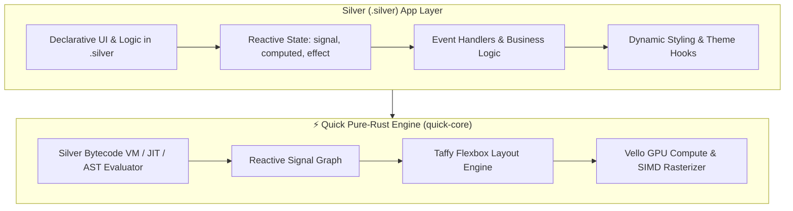

# Silver (`.silver`) Programming Language Specification & Architecture Outline

**Silver** is a lightweight, ergonomic, and reactive programming language specifically engineered for building applications on the **Quick UI Framework**. While **Rust** powers the underlying graphics, layout, and rendering engine, **Silver** allows developers to author declarative UI components, reactive state, business logic, and styling bindings without the boilerplate or borrow-checker friction of raw Rust.

---

## 1. Vision & Core Philosophy



1. **Zero-Friction Reactivity**: Reactive primitives (`signal`, `computed`, `effect`) are first-class language keywords, not external wrapper types.
2. **Seamless Ecosystem Synergy**:
   - **`quick-core`**: Hosts the Silver lexer, AST, bytecode compiler, and runtime virtual machine.
   - **`quick-markup`**: Allows direct embedding of Silver scripts inside `.quick` XML or companion `.silver` code-behind files.
   - **`quick-style`**: Direct access to Material You HCT color roles, design tokens, and style mutations.
3. **Ultra-Fast Startup & Hot Reloading**: Instant parse-and-eval cycle (<1ms) enabling live hot-reloading of UI logic without recompiling Rust binaries.
4. **Type-Inferred Safety**: Static typing with full type inference, null-safety, and pattern matching.

---

## 2. Syntax & Language Tour

### 2.1 Variables, Signals & Reactivity

```silver
// Regular immutable & mutable variables
let app_name: string = "Quick Gallery"
var active_tab = 0

// First-class Reactive State (backed by quick-core::Signal)
signal count: int = 0
signal is_dark_mode: bool = true
signal brightness: float = 75.0

// Computed Signals (automatically tracks dependencies)
computed button_label = if count == 0 {
    "Click Me"
} else {
    "Clicked \(count) times!"
}

computed theme_mode = if is_dark_mode { "Dark Mode" } else { "Light Mode" }

// Effects (runs whenever dependencies mutate)
effect {
    print("State mutated: count is now \(count), theme is \(theme_mode)")
}
```

---

### 2.2 Functions, Events & Actions

```silver
// Standard function with typed parameters and return type
fn add(a: int, b: int) -> int {
    return a + b
}

// Action handlers bound directly to Quick UI events
fn on_increment() {
    count += 1
}

fn on_reset() {
    count = 0
}

fn toggle_theme() {
    is_dark_mode = !is_dark_mode
    // Directly mutate Material You theme via quick-style
    Style.set_dark_mode(is_dark_mode)
}
```

---

### 2.3 Direct Markup & Component Integration

Silver code can either live in a standalone `.silver` file or be embedded directly inside a `.quick` file:

```silver
// CounterComponent.silver
import quick.ui
import quick.style

component CounterCard {
    // Component Properties
    prop title: string = "Reactive Counter"
    prop initial_value: int = 0

    // Component State
    signal count: int = initial_value
    computed status = "Current value: \(count)"

    // View Definition (Direct integration with quick-markup)
    view {
        Card(class: "elevated", padding: 24, radius: 16) {
            Text(text: title, size: 20, weight: "bold", color: Theme.on_surface)
            Text(text: status, size: 14, color: Theme.secondary)

            HStack(gap: 12, margin_top: 16) {
                Button(variant: "filled", text: "Increment", onclick: fn() { count += 1 })
                Button(variant: "tonal",  text: "Decrement", onclick: fn() { count -= 1 })
                Button(variant: "text",   text: "Reset",     onclick: fn() { count = 0 })
            }
        }
    }
}
```

---

### 2.4 Dynamic Styling & Theme Integration (`quick-style`)

```silver
// Accessing Material You Design Tokens directly
fn apply_custom_branding(seed_hex: string) {
    let seed_color = Color.from_hex(seed_hex)
    let palette = Theme.from_seed(seed_color, variant: .vibrant, dark: is_dark_mode)
    
    // Dynamically inject into quick-style
    Style.set_active_theme(palette)
}

// Inline styling with design tokens
let card_style = Style {
    background: Theme.surface_container
    border_radius: Tokens.Radius.md
    shadow: Tokens.Elevation.level2
    padding: Tokens.Spacing.lg
}
```

---

## 3. Architecture & Compiler Pipeline (`quick-core`)

```
               ┌──────────────────────────────┐
               │    Silver Source (.silver)   │
               └──────────────┬───────────────┘
                              │
                    Lexer & SIMD Tokenizer
                              │
                              ▼
               ┌──────────────────────────────┐
               │    Abstract Syntax Tree      │
               └──────────────┬───────────────┘
                              │
                  Type Checker & Validator
                              │
                              ▼
               ┌──────────────────────────────┐
               │   Silver Bytecode Compiler   │
               └──────────────┬───────────────┘
                              │
                     Silver VM Runtime
              (Stack / Register-based VM Arena)
                              │
             ┌────────────────┼────────────────┐
             ▼                ▼                ▼
     ┌───────────────┐ ┌─────────────┐ ┌──────────────┐
     │  quick-core   │ │ quick-style │ │ quick-markup │
     │ Signal Engine │ │ Theme Token │ │ Widget Tree  │
     └───────────────┘ └─────────────┘ └──────────────┘
```

### 3.1 Components in `quick-core`:
1. **`silver_lexer.rs`**: High-performance zero-allocation tokenizer with SIMD string literal and keyword scanning.
2. **`silver_ast.rs`**: AST nodes representing expressions, statements, component declarations, signals, and closures.
3. **`silver_parser.rs`**: Recursive-descent Pratt parser generating typed ASTs with descriptive compiler diagnostics.
4. **`silver_vm.rs`**: Compact, register-based bytecode interpreter running inside the frame bump arena with O(1) execution overhead.
5. **`silver_bridge.rs`**: Binds Silver variables, functions, and reactive signals directly into `quick_core::DataContext` and `quick_markup::builder`.

---

## 4. Full Real-World Example: Material You Showcase in `.silver`

```silver
// app.silver - Complete Application Logic & View
import quick.ui
import quick.style

app MaterialYouShowcase {
    // 1. Reactive State
    signal click_count: int = 0
    signal is_gpu_active: bool = true
    signal brightness_val: float = 75.0
    signal selected_chip: string = "Vello GPU"

    // 2. Computed Properties
    computed greeting = if click_count == 0 {
        "Welcome to your Silver + Quick application!"
    } else {
        "🎉 You clicked the button \(click_count) times! (Sub-microsecond reactivity)"
    }

    // 3. View Tree
    view {
        VStack(width: 100%, height: 100%, align: .center, justify: .center, background: #141218) {
            Card(class: "main-card", max_width: 580, padding: 32, radius: 20) {
                
                Text(text: "SILVER LANGUAGE ACTIVE", class: "pill-badge")
                Text(text: "Hello from Silver!", size: 26, weight: "bold", color: Theme.on_surface)
                Text(text: greeting, size: 15, weight: "bold", color: Theme.primary)

                // Controls
                HStack(justify: .space_between, width: 100%) {
                    Text(text: "Hardware GPU Acceleration", weight: "bold")
                    Switch(checked: is_gpu_active, onchange: fn(val) { is_gpu_active = val })
                }

                Slider(min: 0.0, max: 100.0, value: brightness_val, onchange: fn(val) { brightness_val = val })

                // Chip Selector
                HStack(gap: 8, justify: .center) {
                    for chip_name in ["Wayland", "Pure Rust", "Vello GPU"] {
                        Chip(
                            text: chip_name,
                            selected: selected_chip == chip_name,
                            onclick: fn() { selected_chip = chip_name }
                        )
                    }
                }

                // Actions
                HStack(gap: 16, margin_top: 16) {
                    Button(variant: "filled", text: "Click Me", onclick: fn() { click_count += 1 })
                    Button(variant: "outlined", text: "Reset",   onclick: fn() { click_count = 0 })
                }
            }
        }
    }
}
```

---

## 5. Phased Implementation Roadmap

| Phase | Milestone Name | Key Deliverables |
|---|---|---|
| **Phase 1** | **Lexer, AST & Parser (`quick-core::silver`)** | Tokenizer, AST node structures, parser, and error diagnostics for expressions, statements, and functions. |
| **Phase 2** | **Silver Virtual Machine (VM)** | Stack/register VM, bytecode instruction set, opcode compiler, and variable scopes in `quick-core`. |
| **Phase 3** | **Signal & Reactivity Bridge** | First-class `signal`, `computed`, and `effect` keywords bound directly into `quick_core::Signal<T>` and `DataContext`. |
| **Phase 4** | **`quick-markup` & `quick-style` Binding** | Embedded `<Silver>` scripting in `.quick` files, component template expansion, and dynamic token querying. |
| **Phase 5** | **Developer Tooling & JIT / Hot-Reload** | Live file-watcher for `.silver` hot-reloading without app restart, and CLI runner (`quick run app.silver`). |
