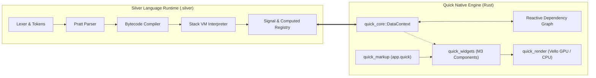

# Silver Programming Language Specification (v0.1.0)
*The Official Technical Language and Virtual Machine Specification*

---

## 1. Introduction & Objectives

**Silver** (`.silver`) is an embeddable, reactivity-first, statically and dynamically typed programming language engineered explicitly for the **Quick Native UI Framework**. 

Silver replaces verbosity and compilation turnaround times with an ultra-lightweight, high-speed bytecode VM that binds fine-grained reactive signals directly to GUI components, layout constraints, and styling tokens.

### Key Characteristics
1. **First-Class Reactivity**: `signal`, `computed`, and `effect` are native language statements with automatic dependency subscription and batching.
2. **First-Class UI Types**: Native color literals (`#6750A4`, `#RRGGBBAA`), geometric primitives, and layout tokens.
3. **Ergonomic Swift/Rust-Inspired Syntax**: String interpolation `\(expr)`, expression-based `if`/`else`, concise type annotations (`: int`), and block closures.
4. **Dual Execution Engine**:
   - **Bytecode Compiler**: Emits dense, cache-friendly bytecode chunks (`Opcode`).
   - **Stack Virtual Machine**: High-throughput register/stack interpreter with microsecond startup overhead.
5. **Direct Quick Framework Bridge**: Seamless two-way binding with `quick_core::Signal<T>`, `DataContext`, and `.quick` declarative XML markup.

---

## 2. Lexical Structure

### 2.1 Character Set & Encoding
Silver source code is encoded in valid **UTF-8**. Source files typically use the `.silver` file extension.

### 2.2 Whitespace and Comments
- **Whitespace**: Space (`U+0020`), Horizontal Tab (`U+0009`), Newline (`\n`, `U+000A`), and Carriage Return (`\r`, `U+000D`). Whitespace is non-semantic except as a token delimiter.
- **Single-Line Comments**: Begin with `//` and extend to the end of the line.
- **Multi-Line Block Comments**: Begin with `/*` and end with `*/`. (Nesting is supported).

### 2.3 Identifiers
Identifiers name variables, signals, functions, types, and properties.
```
Identifier      ::= [a-zA-Z_] [a-zA-Z0-9_]*
```

### 2.4 Keywords
The following keywords are reserved in Silver:

| Category | Keywords |
| :--- | :--- |
| **Reactivity** | `signal`, `computed`, `effect` |
| **Declarations** | `let`, `var`, `fn`, `component` |
| **Control Flow** | `if`, `else`, `while`, `for`, `in`, `return` |
| **Booleans & Null** | `true`, `false`, `null` |
| **Logical Operators**| `and`, `or`, `not` |
| **Import / Export** | `import`, `export`, `as` |

### 2.5 Literals

#### 2.5.1 Integer & Float Literals
- **Integers**: Sequences of decimal digits `[0-9]+` (e.g. `0`, `42`, `1000`). Hexadecimal (`0x1F`) and binary (`0b1010`) prefixes are reserved.
- **Floats**: Decimal digits with a fractional dot `[0-9]+\.[0-9]+` (e.g. `3.14`, `0.5`, `100.0`).

#### 2.5.2 String Literals & String Interpolation
String literals are enclosed in double quotes `"..."`.
- **Escape sequences**: `\\`, `\"`, `\n`, `\t`, `\r`.
- **String Interpolation**: Expressions enclosed in `\(...)` are evaluated dynamically and converted to strings:
  ```silver
  "Current count is: \(count) at step \(step + 1)"
  ```

#### 2.5.3 Hex Color Literals
Colors can be written as native literals starting with `#`:
- `#RGB`: Expands to `#RRGGBB` (e.g. `#F00` $\rightarrow$ Red)
- `#RGBA`: Expands to `#RRGGBBAA` (e.g. `#F008`)
- `#RRGGBB`: 24-bit sRGB color (e.g. `#6750A4`)
- `#RRGGBBAA`: 32-bit RGBA color with alpha (e.g. `#6750A480`)

---

## 3. Type System

Silver combines runtime dynamic typing with optional static type hints.

### 3.1 Primitive Types
- `null`: Represents absence of value.
- `bool`: `true` or `false`.
- `int`: Signed 64-bit integer (`i64`).
- `float`: 64-bit IEEE 754 floating-point number (`f64`).
- `string`: UTF-8 string buffer (`Arc<String>`).
- `color`: 32-bit RGBA color tuple `(u8, u8, u8, u8)`.

### 3.2 Collection Types
- `List<T>`: Dynamically sized contiguous array of values `[Value]`.
- `Map<K, V>`: Key-value hash map `{Key: Value}`.

### 3.3 Reactive Types
- `Signal<T>`: A mutable reactive container holding a value of type `T`. Reading tracks dependency; writing triggers subscribers.
- `Computed<T>`: A lazily or eagerly recomputed reactive value derived from other signals.

### 3.4 Function Types
- `fn(T1, T2, ...) -> R`: First-class function or closure with parameter types and return type.
- `NativeFn`: A host Rust function registered with the Silver VM.

---

## 4. Formal Grammar (EBNF)

```ebnf
Program         ::= Statement*

Statement       ::= LetDecl
                  | VarDecl
                  | SignalDecl
                  | ComputedDecl
                  | EffectDecl
                  | FunctionDecl
                  | ComponentDecl
                  | IfStatement
                  | WhileStatement
                  | ForStatement
                  | ReturnStatement
                  | ExprStatement
                  | ";"

LetDecl         ::= "let" Identifier (":" Type)? "=" Expression (";")?
VarDecl         ::= "var" Identifier (":" Type)? "=" Expression (";")?
SignalDecl      ::= "signal" Identifier (":" Type)? "=" Expression (";")?
ComputedDecl    ::= "computed" Identifier "=" Expression (";")?
EffectDecl      ::= "effect" Block

FunctionDecl    ::= "fn" Identifier "(" ParamList? ")" ("->" Type)? Block
ParamList       ::= Param ("," Param)*
Param           ::= Identifier (":" Type)?

ComponentDecl   ::= "component" Identifier "(" ParamList? ")" Block

IfStatement     ::= "if" Expression Block ("else" (IfStatement | Block))?
WhileStatement  ::= "while" Expression Block
ForStatement    ::= "for" Identifier "in" Expression Block
ReturnStatement ::= "return" Expression? (";")?
ExprStatement   ::= Expression (";")?

Block           ::= "{" Statement* "}"

Type            ::= "int" | "float" | "string" | "bool" | "color" | "any"
                  | "List" "<" Type ">"
                  | "Signal" "<" Type ">"
                  | Identifier

Expression      ::= Assignment
Assignment      ::= (Identifier | MemberAccess) ("=" | "+=" | "-=" | "*=" | "/=") Assignment
                  | LogicalOr

LogicalOr       ::= LogicalAnd (("or" | "||") LogicalAnd)*
LogicalAnd      ::= Equality (("and" | "&&") Equality)*
Equality        ::= Comparison (("==" | "!=") Comparison)*
Comparison      ::= Term (("<" | "<=" | ">" | ">=") Term)*
Term            ::= Factor (("+" | "-") Factor)*
Factor          ::= Unary (("*" | "/" | "%") Unary)*
Unary           ::= ("-" | "!" | "not") Unary | Call
Call            ::= Primary ( "(" ArgList? ")" | "." Identifier | "[" Expression "]" )*
ArgList         ::= Expression ("," Expression)*

Primary         ::= IntegerLiteral
                  | FloatLiteral
                  | StringLiteral
                  | HexColorLiteral
                  | "true" | "false" | "null"
                  | Identifier
                  | "(" Expression ")"
                  | "[" (Expression ("," Expression)*)? "]"
                  | "{" (MapEntry ("," MapEntry)*)? "}"
                  | IfExpression

IfExpression    ::= "if" Expression (Block | Expression) "else" (Block | Expression)
MapEntry        ::= (StringLiteral | Identifier) ":" Expression
```

---

## 5. Bytecode Architecture & VM Instruction Set

The Silver compiler targets a compact, stack-based bytecode virtual machine.

### 5.1 Opcode Specification

| Opcode | Hex | Operand | Description |
| :--- | :--- | :--- | :--- |
| `Constant` | `0x00` | `u16` (index) | Push constant from constant pool onto the stack |
| `Nil` | `0x01` | None | Push `Value::Null` onto stack |
| `True` | `0x02` | None | Push `Value::Bool(true)` onto stack |
| `False` | `0x03` | None | Push `Value::Bool(false)` onto stack |
| `Pop` | `0x04` | None | Pop the top value from the stack |
| `GetGlobal` | `0x05` | `u16` (name idx) | Load global variable / computed signal by name |
| `SetGlobal` | `0x06` | `u16` (name idx) | Store top-of-stack to global variable |
| `GetLocal` | `0x07` | `u16` (slot) | Load value from local stack frame slot |
| `SetLocal` | `0x08` | `u16` (slot) | Store top-of-stack into local stack frame slot |
| `GetSignal` | `0x09` | `u16` (name idx) | Read reactive signal value (recording dependency) |
| `SetSignal` | `0x0A` | `u16` (name idx) | Write reactive signal value (triggering dependents) |
| `SetComputed` | `0x0B` | `u16` (name idx) | Register a dynamic computed signal chunk |
| `Add` | `0x0C` | None | Arithmetic addition or string concatenation |
| `Subtract` | `0x0D` | None | Arithmetic subtraction |
| `Multiply` | `0x0E` | None | Arithmetic multiplication |
| `Divide` | `0x0F` | None | Arithmetic division (checks division by zero) |
| `Modulo` | `0x10` | None | Integer modulo operation |
| `Equal` | `0x11` | None | Compare top two values for equality |
| `Greater` | `0x12` | None | Compare `a > b` |
| `Less` | `0x13` | None | Compare `a < b` |
| `Not` | `0x14` | None | Logical boolean negation |
| `Negate` | `0x15` | None | Numeric arithmetic negation (`-x`) |
| `Jump` | `0x16` | `u16` (offset) | Unconditional forward jump |
| `JumpIfFalse`| `0x17` | `u16` (offset) | Jump forward if top-of-stack is falsey |
| `Loop` | `0x18` | `u16` (offset) | Unconditional backward jump to loop header |
| `Call` | `0x19` | `u8` (arg count)| Invoke function or native host closure |
| `Return` | `0x1A` | None | Return from function or chunk execution |
| `ConcatString`| `0x1B` | `u8` (count) | Pop `count` items, convert to string and concatenate |
| `MakeList` | `0x1C` | `u16` (count) | Pop `count` items and bundle into a `Value::List` |

---

## 6. Quick UI Runtime Integration



### 6.1 Two-Way Signal Binding
When a `.silver` file declares `signal count = 0`, the Silver runtime registers it with `quick_core::DataContext`. 
- When a Quick `<Button on_click="increment" />` is clicked, the action fires in the Silver VM, mutating `count += 1`.
- All bound `<Text content="$count" />` widgets immediately re-render on the next Vello frame.
