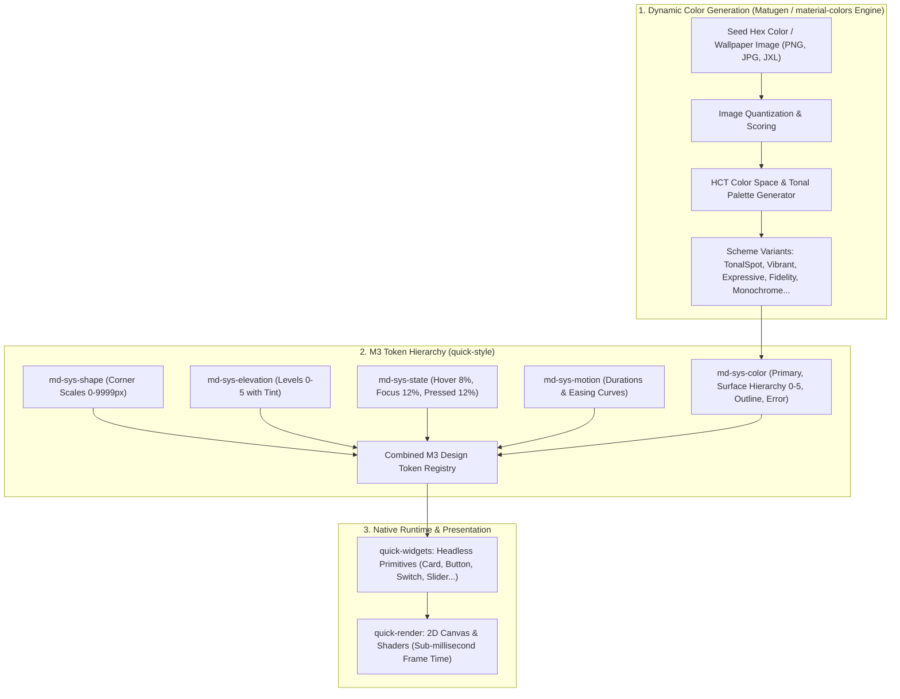
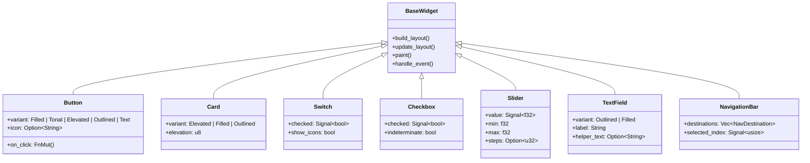

# 🎨 Google Material You (M3) Full UI Theme & Component Integration Architecture

This document establishes the comprehensive technical blueprint for integrating the complete **Google Material You (Material Design 3)** design system from [material-components/material-web](https://github.com/material-components/material-web) and the **Matugen / Material Colors Engine** ([InioX/matugen](https://github.com/InioX/matugen)) into the **Quick Native UI Framework**.

---

## 🏛️ 1. Integration Philosophy & Architecture

Google's Material You dynamically calculates all tonal color palettes, contrast ratios, and theme tokens from a user's wallpaper or custom seed color. Quick integrates the **Matugen / `material-colors` algorithm in 100% Pure Rust**, delivering real-time dynamic theming with zero Node.js/DOM overhead.



---

## 🌈 2. Dynamic HCT Color Generation Engine (Powered by Matugen / `material-colors`)

### A. Dynamic Color Roles (`md-sys-color`)
Instead of static hardcoded HEX values, Quick uses the **Google HCT (Hue, Chroma, Tone)** algorithm to derive mathematically harmonious palettes from any seed color or desktop wallpaper.

```text
Seed Color / Image ──► Tonal Palettes (Tones 0, 10, 20...90, 95, 99, 100) ──► 32+ M3 Roles (Light & Dark)
```

#### Scheme Variants Supported:
| Scheme Variant | Visual Characteristic | Best Suited For |
| :--- | :--- | :--- |
| **`TonalSpot`** *(Default)* | Balanced, calm pastel accents with high contrast readability | Standard Material You default, desktop productivity apps |
| **`Vibrant`** | High-saturation, punchy accent colors | Media players, gaming dashboards, creative tools |
| **`Expressive`** | Playful, contrasting secondary/tertiary harmonies | Social apps, modern communication suites |
| **`Fidelity`** | Closely matches the exact seed color tone | Corporate brand identity, strict palette matching |
| **`FruitSalad`** | Vibrant contrasting hues | High-energy interfaces |
| **`Monochrome`** | Pure grayscale with tone-based contrast | Minimalist, distraction-free reading environments |
| **`Neutral`** | Subtle, low-chroma tones | Industrial HMIs, telemetry monitors |

---

### B. Complete M3 Token Roles Generated

| Role Group | Tokens Output by Matugen Engine |
| :--- | :--- |
| **Primary** | `primary`, `on-primary`, `primary-container`, `on-primary-container`, `inverse-primary` |
| **Secondary** | `secondary`, `on-secondary`, `secondary-container`, `on-secondary-container` |
| **Tertiary** | `tertiary`, `on-tertiary`, `tertiary-container`, `on-tertiary-container` |
| **Surface Hierarchy** | `surface`, `on-surface`, `surface-variant`, `on-surface-variant`, `surface-container-lowest`, `surface-container-low`, `surface-container`, `surface-container-high`, `surface-container-highest`, `surface-dim`, `surface-bright`, `surface-tint` |
| **Outlines** | `outline` (strong container borders), `outline-variant` (subtle dividers) |
| **Error** | `error`, `on-error`, `error-container`, `on-error-container` |
| **Scrim & Shadow** | `shadow`, `scrim`, `inverse-surface`, `inverse-on-surface` |

---

### C. Shape Scale System (`md-sys-shape`)
Directly mapped from `_md-sys-shape.scss`:

| Shape Token | Radius | Applied Component Types |
| :--- | :--- | :--- |
| `corner-none` | $0\text{ px}$ | Fullscreen canvas, square media |
| `corner-extra-small` | $4\text{ px}$ | Filled/Outlined text fields (top corners), snackbars |
| `corner-small` | $8\text{ px}$ | Small chips, tooltip overlays |
| `corner-medium` | $12\text{ px}$ | Small dialogs, sub-cards |
| `corner-large` | $16\text{ px}$ | Standard cards, alert dialogs, modal sheets |
| `corner-extra-large`| $28\text{ px}$ | Large FABs, search bars, navigation drawers |
| `corner-full` | $9999\text{ px}$ | Common buttons, filter chips, pill badges, switch tracks |

---

### D. Elevation & Shadow Levels (`md-sys-elevation`)
Quick renders elevation using dual-pass drop shadows and dynamic surface tinting:

| Level | Elevation DP | Key Shadow | Ambient Shadow | Surface Tint |
| :--- | :--- | :--- | :--- | :--- |
| **Level 0** | $0\text{ dp}$ | `none` | `none` | $0\%$ |
| **Level 1** | $1\text{ dp}$ | `0px 1px 2px rgba(0,0,0,0.30)` | `0px 1px 3px 1px rgba(0,0,0,0.15)` | $5\%$ |
| **Level 2** | $3\text{ dp}$ | `0px 1px 2px rgba(0,0,0,0.30)` | `0px 2px 6px 2px rgba(0,0,0,0.15)` | $8\%$ |
| **Level 3** | $6\text{ dp}$ | `0px 1px 3px rgba(0,0,0,0.30)` | `0px 4px 8px 3px rgba(0,0,0,0.15)` | $11\%$ |
| **Level 4** | $8\text{ dp}$ | `0px 2px 3px rgba(0,0,0,0.30)` | `0px 6px 10px 4px rgba(0,0,0,0.15)` | $12\%$ |
| **Level 5** | $12\text{ dp}$ | `0px 4px 4px rgba(0,0,0,0.30)` | `0px 8px 12px 6px rgba(0,0,0,0.15)` | $14\%$ |

---

### E. State Layer Opacities (`md-sys-state`)
Overlaid on component backgrounds during pointer interactions:
- **Hover**: $8\%$ opacity of `on-<surface/primary>`
- **Focus**: $12\%$ opacity
- **Pressed**: $12\%$ opacity
- **Dragged**: $16\%$ opacity
- **Disabled**: $38\%$ opacity for content, $12\%$ for container surfaces

---

## 📦 3. Complete Component Implementation Catalog



---

## 📋 4. Dynamic Theme Configuration with Matugen (`material-you.theme.toml`)

Developers can point the theme engine to a seed hex, a wallpaper image path, or the current OS wallpaper:

### `themes/material-you.theme.toml`:
```toml
[theme]
name = "material-you"
version = "3.0.0"
engine = "matugen"

[generator]
# Options: "seed_color", "image_path", or "system_wallpaper"
mode = "seed_color"
seed_color = "#6750A4"
# image_path = "assets/wallpaper.jpg"

# Variant: "tonal_spot", "vibrant", "expressive", "fidelity", "monochrome"
variant = "vibrant"
contrast = 0.0 # Range: -1.0 (low) to 1.0 (high)
color_mode = "dark" # "dark" | "light" | "system"

[tokens.shapes]
corner_none = 0.0
corner_extra_small = 4.0
corner_small = 8.0
corner_medium = 12.0
corner_large = 16.0
corner_extra_large = 28.0
corner_full = 9999.0

[tokens.state_layers]
hover = 0.08
focus = 0.12
pressed = 0.12
dragged = 0.16
disabled = 0.38
```

---

## 💻 5. Rust Dynamic Theming API

```rust
use quick::prelude::*;
use quick_style::theme::{ThemePackage, SchemeVariant};

fn main() -> Result<(), Box<dyn std::error::Error>> {
    let mut data_ctx = DataContext::new();

    // Dynamically generate Material You theme from a Seed Color or Wallpaper
    let m3_theme = ThemePackage::from_seed_color(
        "#6750A4",
        SchemeVariant::Vibrant,
        /* is_dark */ true,
    );

    // Or extract dominant palette directly from an image:
    // let m3_theme = ThemePackage::from_image("assets/wallpaper.png", SchemeVariant::TonalSpot, true)?;

    let app = App::new(
        WindowOptions::new()
            .title("Material You Dynamic UI - Quick Framework")
            .size(720.0, 580.0),
    )
    .with_theme(m3_theme)
    .from_quick(include_str!("app.quick"), &mut data_ctx)?;

    app.run()
}
```

---

## ⚡ 6. Performance & Architecture Comparison

| Feature | Official Google `material-web` | Quick + Matugen Engine |
| :--- | :--- | :--- |
| **Language** | TypeScript / Lit / Web Components | 100% Pure Rust |
| **Runtime Dependency** | Browser DOM / V8 JavaScript Engine | Zero Runtime Overhead (Native Executable) |
| **Color Generation** | Build-time Figma Plugin or Web APIs | Real-time On-Device (Matugen HCT Algorithm) |
| **Frame Latency** | $\sim 8\text{--}16\text{ms}$ (Browser compositor) | **$< 1\text{ms}$** (Skia / Softbuffer Wayland presentation) |
| **Memory Footprint** | $150\text{MB}+$ (Chromium / WebKit) | **$\sim 12\text{MB}$** (Zero-heap bump arena) |
| **Theme Switching** | Reload or CSS Variable Re-injection | Instant Reactive Signal Updates |
